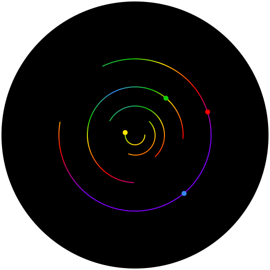

[](https://github.com/apple/swift-package-manager)
# UDF
<p align="center">

 </p>

**UDF** (Unidirectional Data Flow) is a library based on [Unidirectional Data Flow](https://en.wikipedia.org/wiki/Unidirectional_Data_Flow_(computer_science)) pattern. It lets you build maintainable, testable, and scalable apps.

## Unidirectional Data Flow Design Pattern
A unidirectional data flow is a design pattern where a state (data) flows down and events (actions) flow up. It's important that UI never edits or sends back data. That's why UI usually provided with immutable data.  It allows having a single source of truth for a whole app and effectively separates domain logic from UI.
<p align="center">

 </p>
 Unidirectional Data Flow design pattern has been popular for a long time in web development. Now it's time for mobile development. Started from multi-platform solutions like React Native and Flutter, Unidirectional Data Flow now becomes a part of native. [SwiftUI](https://developer.apple.com/documentation/swiftui/state-and-data-flow) for Swift and [Jetpack Compose](https://developer.android.com/jetpack/compose/architecture#udf) for Kotlin are implemented based on ideas of UDF. That's why we in inDriver decide to develop our own UDF library for our purposes.
 
 ## Advantages
 Here are the main advantages of this UDF implementation:
 * **Testable**. All domain logic implements in pure functions, so it's easy to unit test it. All UI depends only on provided data, so it's easy to configure and cover by snapshot tests.
 * **Scalable and Reusable**. Low Coupling and High Cohesion are ones of the basic principles of good software design. UDF implements such principles in practice. It allows to decouple UI and Domain, create reusable features, and scale business logic in a convenient way. 
 * **Easy working with concurrency**. The UDF obviously doesn't solve all potential concurrent problems. But it alleviates working with concurrency in regular cases. State updating always runs on separate serial queue. It guarantees the consistency of a state after any changes. For UI or an async task you can use ViewComponent or ServiceComponent protocols respectively. They will subscribe your components on main or background thread so you can concentrate on business tasks rather than concurrency. 
 * **Free of FRP frameworks**. We decided not to use functional reactive frameworks in our library. Instead, we provided it with a convenient way for subscribing to state updates, so in most cases, you don't even need to know how it works. The absence of FRP frameworks also means that you can't use the UDF with SwiftUI right now. But We're planning to add Combine version of the UDF in near future. It will only affect the subscription process, so you will not have to rewrite your domain logic. 

Differences from other popular UDF implementations:

[RxFeedback](https://github.com/NoTests/RxFeedback.swift) - requires RxSwift

[The Composable Architecture](https://github.com/pointfreeco/swift-composable-architecture) - iOS13+ only because of Combine

[ReSwift](https://github.com/ReSwift/ReSwift) - no instruments for modularization

 ## Basic Usage
 Let's imagine a simple counter app. It shows a counter label and two buttons "+" and "-" to increment and decrement the counter. Let's consider the stages of its creation.
 ### Building Domain
Firstly we need to declare the state of the app:
 
 ```swift
struct AppState: Equatable {
    var counter = 0
}
```
**State** is all the data of an app. In our case, it's just an int counter.
Next, we need to know when buttons are tapped:

 ```swift
enum CounterAction: Action {
  case decrementButtonTapped
  case incrementButtonTapped
}
```
We use an enum and `Action` protocol for that. **Action** describes all of the actions that can occur in your app.
Next, we need to update our state according to an action:

 ```swift
func counterReducer(state: inout AppState, action: Action) {
    guard let action = action as? CounterAction else { return }

    switch action {
    case .decrementButtonTapped:
        state.counter -= 1
    case .incrementButtonTapped:
        state.counter += 1
    }
}
```
**Reducer** is a pure function that updates a state.
Now we need to glue it together:

 ```swift
let store = Store<AppState>(state: .init(), reducer: counterReducer)
```
**Store** combines all the above things together. 

### View Component

Let's take a look at UI now:
 ```swift
class CounterViewController: UIViewController, ViewComponent {

   typealias Props = Int

    @IBOutlet var counterLabel: UILabel!
    var disposer = Disposer()

    var props: Int = 0 {
        didSet {
            guard isViewLoaded else { return }
            counterLabel.text = "\(props)"
        }
    }
    
    @IBAction func decreaseButtonTapped(_ sender: UIButton) {
        store.dispatch(CounterAction.decrementButtonTapped)
    }

    @IBAction func increaseButtonTapped(_ sender: UIButton) {
        store.dispatch(CounterAction.incrementButtonTapped)
    }
}
```
`CounterViewController` implements `ViewComponent` protocol. It guarantees that a component receives a new state only if it was changed and always in the main thread. In `CounterViewController` we declare props property and update UI in its didSet. Now we have to connect out ViewController to the store:

 ```swift
 let counterViewController = CounterViewController()
 counterViewController.connect(to: store, state: \.counter)
  ```
 Notice that we can choose with part of the state we want to observe.
  
 ### Modularisation 
 
Imagine that you would like to reuse your `CounterViewController` in another app. Or you have a much bigger reusable feature with many View Controllers. In this case, your AppState will look like this: 
 
  ```swift
struct AppState: Equatable {
    var counter = 0
    var bigFeature = BigFeature()
}
```
Obviously you don't want that your features will know about AppState. You can easily decouple them by scope:

 ```swift
 let store = Store<AppState>(state: .init(), reducer: counterReducer)
 
 connectCounter(to: store.scope(\.counter))
 connectBigFeature(to: store.scope(\.bigFeature))
 
 ...
 
 //Somewhere in Counter.framework
 func connectCounter(to store: Store<Int>) {
   ...
   counterViewController.connect(to: store)
 }
 
 //Somewhere in BigFeature.framework
 func connectCounter(to store: Store<BigFeature>) {
  ...
  firstViewController.connect(to: store, state: \.first)
 }
 
```
Now you can move your features to separate frameworks and use then wherever you want.
 
 ## Installation
 
You can add the UDF to an Xcode project by adding it as a package dependency.

1. Open File › Swift Packages › Add Package Dependency…
2. Enter "https://github.com/inDriver/UDF"
3. Choose the last version
 
 ## Inspiration & Acknowledgments
 
 The UDF idea is based on [Alexey Demedetskiy](https://github.com/AlexeyDemedetskiy) ideas and [MaximBazarov](https://github.com/MaximBazarov) implementation of Unidirection Data Flow Pattern. Originally the UDF was a fork of [Unicore](https://github.com/Unicore/Unicore).
 
 [The Composable Architecture](https://github.com/pointfreeco/swift-composable-architecture) inspired our implementation of a scope function and modularisation.

Also, we would like to thank all people that taking part in development, testing, and using the UDF:
[Artem Lytkin](https://github.com/artem-lytkin), [Ivan Dyagilev](https://github.com/jinnerrer), [Andrey Zamorshchikov](https://github.com/andreyzamorshchikov), [Dmitry Filippov](https://github.com/DimFilippov), [Eldar Adelshin](https://github.com/AdelshinEldar), [Anton Nochnoy](https://github.com/nochnoy-anton), [Denis Sidorenko](https://github.com/justaSid), [Ilya Kuznetsov](https://github.com/imkuznetsov) and [Viktor Gordienko](https://github.com/v-gordienko).

If you have any questions or suggestions, please contact [Anton Goncharov](https://github.com/MasterWatcher) or [Yuri Trykov](https://github.com/trykovyura).

 ## License

UDF is released under the Apache 2.0 license. [See LICENSE](https://github.com/inDriver/UDF/blob/master/LICENSE) for details.

    Copyright 2021  Suol Innovations Ltd.

    Licensed under the Apache License, Version 2.0 (the "License");
    you may not use this file except in compliance with the License.
    You may obtain a copy of the License at

       http://www.apache.org/licenses/LICENSE-2.0

    Unless required by applicable law or agreed to in writing, software
    distributed under the License is distributed on an "AS IS" BASIS,
    WITHOUT WARRANTIES OR CONDITIONS OF ANY KIND, either express or implied.
    See the License for the specific language governing permissions and
    limitations under the License.
